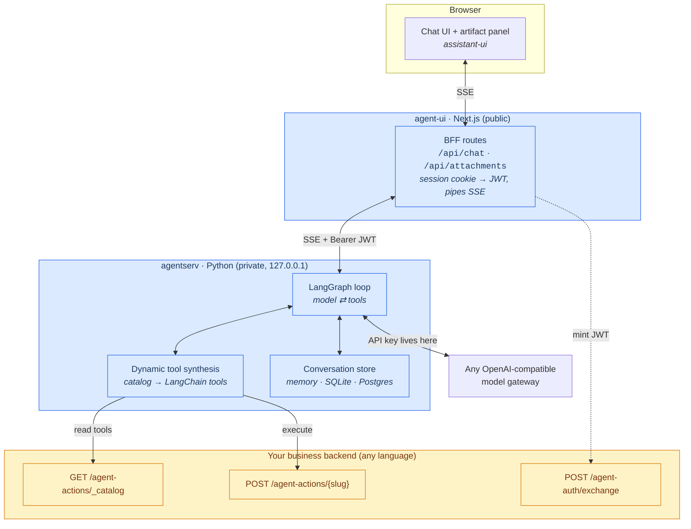
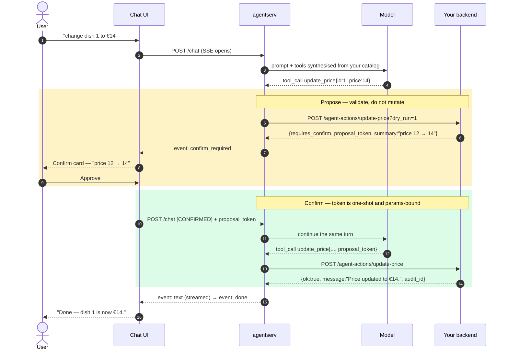

<div align="center">

# CogriaAgent

**Give any application a conversational agent — you write the actions, the framework brings the rest.**

Define what your product can do as a handful of typed actions with plain-English
descriptions. CogriaAgent supplies the LLM orchestration, the streaming chat UI,
the tool calling, the confirm-before-write safety flow, and the auth plumbing.

[Quick start](#quick-start) · [Architecture](#architecture) · [Use cases](#use-cases) · [Docs](./docs) · [中文说明](./README.zh-CN.md)

</div>

---

## The idea

Most "add AI to my app" projects re-solve the same problems: streaming, tool
calling, keeping the model from doing something destructive, session history,
turning API errors into sentences a human wants to read. None of that is your
business logic, and all of it takes weeks.

CogriaAgent draws one hard line:

> **Your backend never talks to an LLM.** It exposes actions over plain HTTP and
> executes them. The orchestration kernel holds the API key, writes the prompts,
> and runs the tool loop.

So your backend needs no LLM key, no prompt engineering, no LangChain, and no
rewrite when you swap models. It just answers HTTP.

```python
# The entire integration surface for one capability.
class CreateDish(AgentAction):
    name = "create_dish"
    description = (
        "Add a new dish to the menu. Requires confirmation. Use when the user "
        "wants to create or add a menu item with a name, price and category."
    )
    requires_confirm = True          # → the user must approve before it runs

    def params_schema(self):
        return {
            "type": "object",
            "properties": {
                "name":     {"type": "string"},
                "price":    {"type": "number", "minimum": 0},
                "category": {"type": "string", "enum": CATEGORIES},
            },
            "required": ["name", "price", "category"],
        }

    async def handle(self, params, ctx):        # runs only after confirmation
        return STORE.add(params["name"], params["price"], params["category"])

    def proposal_summary(self, params):         # what the confirm card shows
        return f'Add "{params["name"]}" at {params["price"]:.2f}'
```

That is enough for a user to say *"add an espresso for 3 euros"*, get a confirm
card, approve it, and see the row appear — with the write audited. The
`description` is not a comment: it is the only thing the model reads when
deciding whether this action fits the request.

---

## Architecture

Three tiers, each with exactly one job. The kernel in the middle is the only
part that knows an LLM exists.



<div align="center"><sub>🟦 framework, ships with CogriaAgent&nbsp;&nbsp;·&nbsp;&nbsp;🟨 yours to write</sub></div>

### The three seams

The kernel depends on Python `Protocol`s, never on concrete implementations.
That is what makes swapping the business domain a no-op for the framework:

| Seam | Decides | Ships with |
|---|---|---|
| `CatalogProvider` | where the tool list comes from | static dict · HTTP catalog |
| `ActionExecutor` | how an action actually runs | in-process · HTTP to your backend |
| `ConversationBackend` | where history is persisted | in-memory · SQLite · Postgres |

Two more optional seams (`SystemPromptProvider`, `LLMFactory`) let you take over
the prompt and the model choice; three more (`AttachmentStore`,
`AttachmentRepository`, `DocumentExtractor`) switch on file uploads.

---

## How one turn flows

The interesting path is a **write**, because that is where the safety model lives.
A read is the same picture minus the confirm round-trip.



**Why the token matters.** It is bound to the caller, the action, *and* a
canonical fingerprint of the parameters, it is one-shot, and it expires in
minutes. The model cannot approve its own write, replay an approval, or slip
different parameters past a confirmation the user already gave.

### Wire protocol

The kernel streams a small, explicit SSE vocabulary — easy to log, easy to
re-implement:

`ready` · `conversation` · `text` · `tool_call` · `tool_result` ·
`confirm_required` · `error` · `done`

---

## Quick start

**Prerequisites** — [uv](https://docs.astral.sh/uv/), Node + pnpm, Redis, and any
OpenAI-compatible model endpoint.

### Scaffold a new agent

```bash
node packages/create-cogria-agent/index.js my-agent
cd my-agent/agent && cp .env.example .env     # OPENAI_* / AGENT_MODEL / JWT_SECRET
uv run --with pytest --with pytest-asyncio pytest tests
uv run uvicorn app.app:app --host 127.0.0.1 --port 8001
```

You get a working task-list agent, a `docker-compose.yml` (agentserv + Redis,
optional Postgres) and the front-end wiring. Swapping domains means editing
`agent/app/actions.py` — the kernel is never touched.

### Or run an example end to end

```bash
# 1 — kernel + business actions on :8001
cd examples/todo-agent
export OPENAI_BASE_URL=https://your-gateway/v1 OPENAI_API_KEY=sk-...
export AGENT_MODEL=deepseek-chat            # any tool-use-capable model
export JWT_SECRET=$(openssl rand -base64 48)
uv run uvicorn todo_agent.app:app --host 127.0.0.1 --port 8001

# 2 — chat UI + BFF on :3003
cd packages/agent-ui && cp .env.example .env.local
pnpm install && pnpm dev
```

Open <http://localhost:3003/en> and try *"add a todo: buy milk"* → confirm card
→ approve. Full walkthroughs: [`examples/todo-agent`](./examples/todo-agent) ·
[`examples/menu-agent`](./examples/menu-agent).

---

## What you write vs. what you get

| | |
|---|---|
| **You write** | Action definitions (name · English description · JSON Schema · handler · `requires_confirm`) |
| | One auth endpoint that turns your session into a short-lived JWT |
| | A config block (locales, model, prompt) |
| **You get** | LLM orchestration: LangGraph tool loop, multi-round tool calls, turn caps |
| | Streaming chat UI, tool-call visualisation, i18n, artifact panel |
| | Propose/confirm with one-shot params-bound tokens + automatic audit trail |
| | Tools synthesised from your catalog and validated against your schema |
| | Conversation persistence + automatic history summarisation |
| | Optional file uploads: images, PDF, Word, Excel, PowerPoint |
| | JWT verification, Redis-cached exchange, private-by-default kernel |

Your backend stays free of: LLM keys, prompts, LangChain, streaming, and model
version churn.

---

## Use cases

**Natural-language admin for a SaaS product.** Instead of teaching users a
settings tree, let them say *"mark the espresso sold out and drop the latte to
€3.50"*. Every write surfaces a confirm card, so the model proposes and the
human decides.

**A conversational layer over an API you already have.** Adapter mode: actions
run in a small Python service that calls your existing endpoints with `httpx`.
Your main application ships no agent code at all — useful when it is Laravel,
Rails, or anything you would rather not add an LLM stack to.

**Internal operations and support tooling.** Read actions for lookups, write
actions for the risky parts, `requires_confirm` on everything that mutates, and
an audit row with before/after state for each one.

**Document Q&A grounded in your data.** Users attach a PDF, Word, or Excel file
in the composer; the text is extracted server-side and injected into the prompt,
while the model can still call your actions in the same turn.

**Dashboards you talk to.** Read actions return numbers, then the builtin
`render_report` artifact tool draws a line/bar/pie chart or an exportable table
in the side panel — no charting code on your side.

---

## Packages

| Package | Language | Role |
|---|---|---|
| [`packages/agentserv`](./packages/agentserv) | Python | Orchestration kernel — LangGraph, FastAPI, SSE, tool synthesis, persistence. **Long-running service** |
| [`packages/agent-ui`](./packages/agent-ui) | TypeScript | Next.js 16 chat UI + artifact panel + BFF. **Long-running service** |
| [`packages/contract`](./packages/contract) | Python | The HTTP contract: pydantic types, JSON Schema, and a backend-agnostic conformance suite |
| [`packages/backend-py`](./packages/backend-py) | Python | Backend SDK (a library): `AgentAction`, registry, proposal tokens, audit, FastAPI mount |
| [`packages/create-cogria-agent`](./packages/create-cogria-agent) | Node | Scaffolding CLI — one command to a running agent |
| [`examples/todo-agent`](./examples/todo-agent) | — | Minimal domain, in-process wiring |
| [`examples/menu-agent`](./examples/menu-agent) | — | Write-heavy domain via the SDK; same wiring, different business — the kernel is byte-for-byte identical |

**Implementing the contract in another language?** It is deliberately small —
one catalog endpoint, one action endpoint, one auth endpoint. Run
`cogria_contract.conformance` against your implementation to prove it works
before wiring up a model. See [`CONTRACT.md`](./packages/contract/CONTRACT.md).

---

## Optional capabilities

Both are off by default and cost nothing when unused.

```bash
uv add "cogria-agentserv[sql,attachments]"

export AGENT_DB_URL=sqlite+aiosqlite:///./var/agent.db   # durable history
export AGENT_ATTACHMENTS_DIR=./var/attachments           # file uploads
export AGENT_VISION_MODEL=gpt-4o-mini                    # needed for images
# front-end: NEXT_PUBLIC_ATTACHMENTS_ENABLED=1
```

Without `AGENT_DB_URL` conversations live in memory and vanish on restart.
Without `AGENT_ATTACHMENTS_DIR` the composer shows no paperclip. Without
`AGENT_VISION_MODEL` image uploads are politely refused while documents keep
working — a text-only model cannot see pictures, and silently ignoring them
would be worse. See [`docs/attachments.md`](./docs/attachments.md).

---

## Status

**Early but real.** The core path is built and tested end to end against live
models; the governance layer is designed and not yet implemented.

| Area | State |
|---|---|
| Orchestration kernel, seams, SSE protocol | ✅ Working |
| HTTP contract + Python backend SDK + conformance suite | ✅ Working |
| Chat UI, artifact panel, i18n, BFF | ✅ Working |
| Scaffolding CLI + Docker Compose | ✅ Working |
| Durable persistence (SQLite/Postgres) + file uploads | ✅ Working |
| Resumable streams (reattach to a reply after navigating away) | 🚧 In progress |
| Cost quotas, kill switch, prompt eval/ops | 📋 Designed, not implemented |

Verified on the current commit: 110 Python tests pass (3 skip without optional
extras), `next build` succeeds clean, and both examples complete a real-LLM
read → propose → confirm round trip with the write landing in the database.
Roadmap: [`docs/roadmap.md`](./docs/roadmap.md).

> **Pre-1.0.** Interfaces may shift between releases. The HTTP contract is the
> most stable surface and the one to build against.

---

## Documentation

| | |
|---|---|
| [Getting started](./docs/getting-started.md) | Install, scaffold, run the full stack |
| [Architecture](./docs/architecture.md) | Seams, request lifecycle, design decisions |
| [Integration guide](./docs/integration-guide.md) | What each side delivers; embedded vs adapter mode |
| [Backend contract](./packages/contract/CONTRACT.md) | The language-agnostic HTTP spec |
| [Configuration](./docs/configuration.md) | Every environment variable |
| [Attachments](./docs/attachments.md) | Uploads, extraction, token budget, security |
| [Roadmap](./docs/roadmap.md) | What is done, what is next |

---

## Contributing

Issues and pull requests are welcome — especially contract implementations in
other languages, additional artifact renderers, and reports from real
integrations. Please run the test suite before opening a PR:

```bash
uv run --with pytest --with pytest-asyncio --with 'sqlalchemy[asyncio]' --with aiosqlite \
  --with filetype --with python-multipart \
  pytest packages/agentserv/tests packages/backend-py/tests \
         examples/todo-agent/tests examples/menu-agent/tests -q
```

Dropping the optional extras also works — SQL and attachment cases skip
themselves. Real PDF/Word extraction tests additionally need `pymupdf4llm`,
`markitdown[docx,xlsx,pptx]` and `python-docx`.

## License

[MIT](./LICENSE) — use it, fork it, ship it commercially. No strings.
