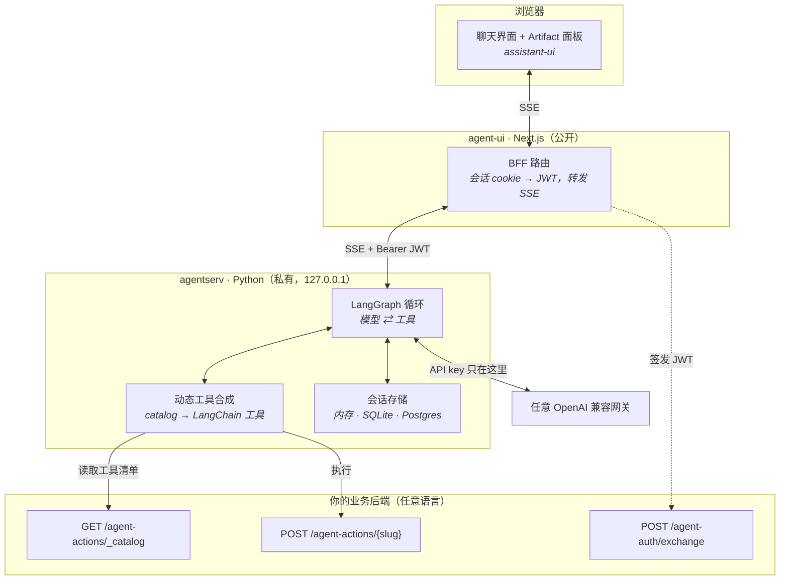
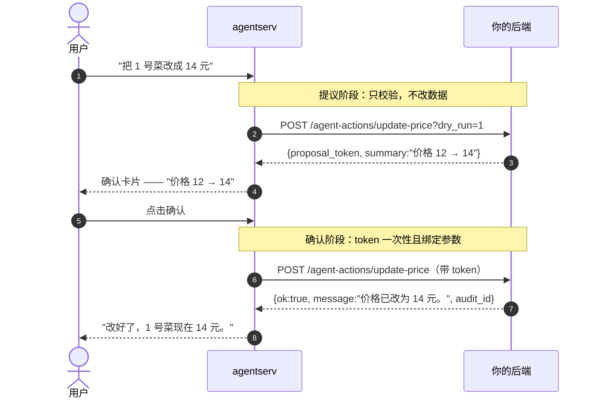

<div align="center">

# CogriaAgent

**给任何应用装上对话式 agent：你只写动作，其余交给框架。**

把产品能力定义成几个带自然语言描述的类型化动作，CogriaAgent 负责 LLM 编排、
流式聊天界面、工具调用、写操作前的确认闸门，以及鉴权链路。

[English](./README.md) · [快速开始](#快速开始) · [架构](#架构) · [完整文档](./docs)

</div>

> 本文是英文 README 的中文摘要。**完整文档以英文为准**，见 [`docs/`](./docs)。

---

## 核心思路

给应用加 AI，大多数团队都要重新解决同一批问题：流式输出、工具调用、防止模型
误操作、会话历史、把 API 报错翻译成人话。这些都不是业务逻辑，却动辄花掉几周。

CogriaAgent 只划一条硬线：

> **你的后端永远不和大模型对话。** 它通过普通 HTTP 暴露动作并执行；持有 API key、
> 编写提示词、跑工具循环的是编排内核。

所以你的后端不需要 LLM key、不需要调提示词、不碰 LangChain，换模型也不用改代码。
它只管回 HTTP。

```python
# 一个能力的全部接入面
class CreateDish(AgentAction):
    name = "create_dish"
    description = (
        "Add a new dish to the menu. Requires confirmation. Use when the user "
        "wants to create or add a menu item with a name, price and category."
    )
    requires_confirm = True          # → 必须用户确认后才执行

    def params_schema(self):
        return {
            "type": "object",
            "properties": {
                "name":     {"type": "string"},
                "price":    {"type": "number", "minimum": 0},
                "category": {"type": "string", "enum": CATEGORIES},
            },
            "required": ["name", "price", "category"],
        }

    async def handle(self, params, ctx):        # 确认之后才会跑
        return STORE.add(params["name"], params["price"], params["category"])

    def proposal_summary(self, params):         # 确认卡片上显示的话
        return f'Add "{params["name"]}" at {params["price"]:.2f}'
```

有这些，用户说一句"加一杯 3 欧的意式浓缩"就能弹出确认卡片、点确认、看到数据落库，
并且这次写入自带审计记录。

> ⚠️ `description` 必须写英文且写清楚**什么时候该用**：这是模型选工具时唯一的依据。
> 绝大多数"agent 不调我的动作"都是描述写得太含糊。

---

## 架构

三层，各司其职。只有中间的内核知道大模型的存在。



### 三条注入接缝

内核只依赖 Python `Protocol`，从不依赖具体实现。这就是"换业务零改内核"的原因：

| 接缝 | 决定 | 内置实现 |
|---|---|---|
| `CatalogProvider` | 工具清单从哪来 | 静态字典 · HTTP catalog |
| `ActionExecutor` | 动作怎么执行 | 同进程 · HTTP 调你的后端 |
| `ConversationBackend` | 历史存在哪 | 内存 · SQLite · Postgres |

另有两条可选接缝（提示词、模型），以及三条用于开启文件上传。

---

## 写操作的安全模型

写动作分两阶段，模型可以**提议**变更，但**批准**只能由人完成。



**token 为什么关键**：它绑定调用者、动作、以及参数的规范化指纹（递归排序 JSON 后
取 sha256），一次性消费，几分钟即过期。因此模型无法自己批准写操作、无法重放一次
批准、也无法在用户确认之后偷换参数。

这同时限定了提示词注入的破坏半径：哪怕一份恶意 PDF 说服模型去执行危险写操作，
用户仍会看到一张写明后果的确认卡片。

---

## 快速开始

**前置**：[uv](https://docs.astral.sh/uv/)、Node + pnpm、Redis，以及任意
OpenAI 兼容的模型端点（模型需支持 tool calling）。

```bash
# 脚手架生成一个新 agent
node packages/create-cogria-agent/index.js my-agent
cd my-agent/agent && cp .env.example .env     # 填 OPENAI_* / AGENT_MODEL / JWT_SECRET
uv run --with pytest --with pytest-asyncio pytest tests
uv run uvicorn app.app:app --host 127.0.0.1 --port 8001

# 前端 + BFF
cd packages/agent-ui && cp .env.example .env.local
pnpm install && pnpm dev                       # http://localhost:3003/en
```

生成的项目自带一个可用的「任务清单」agent。换业务 = 改 `agent/app/actions.py`，
内核一行不动。详见 [Getting started](./docs/getting-started.md)。

---

## 适用场景

**给 SaaS 产品做自然语言后台。** 与其教用户在设置树里翻找，不如让他们直接说
"把意式浓缩标成售罄，拿铁降到 3.5"。每个写操作都会弹确认卡片，模型提议、人来拍板。

**给已有 API 套一层对话。** 适配器模式：动作跑在一个小的 Python 服务里，用 `httpx`
调你现有的接口。主应用一行 agent 代码都不用加，特别适合 Laravel、Rails 这类你不想
塞进 LLM 技术栈的项目。

**内部运维与客服工具。** 读动作查数据，写动作做变更，凡是改数据的都加
`requires_confirm`，每次写入自带前后状态的审计记录。

**基于自有资料的文档问答。** 用户在输入框里传 PDF、Word、Excel，服务端抽取文本注入
提示词，同一轮里模型还能继续调用你的动作。

**能对话的看板。** 读动作返回数字，内置的 `render_report` artifact 工具直接在右侧
面板画折线图、柱状图、饼图或可导出的表格 —— 你不用写任何图表代码。

---

## 包结构

| 包 | 语言 | 作用 |
|---|---|---|
| [`packages/agentserv`](./packages/agentserv) | Python | 编排内核：LangGraph、FastAPI、SSE、工具合成、持久化。**常驻服务** |
| [`packages/agent-ui`](./packages/agent-ui) | TypeScript | Next.js 16 聊天界面 + artifact 面板 + BFF。**常驻服务** |
| [`packages/contract`](./packages/contract) | Python | HTTP 契约：pydantic 类型、JSON Schema、后端无关的一致性测试套件 |
| [`packages/backend-py`](./packages/backend-py) | Python | 后端 SDK（库）：`AgentAction`、注册表、提议 token、审计、FastAPI 挂载 |
| [`packages/create-cogria-agent`](./packages/create-cogria-agent) | Node | 脚手架 CLI |
| [`examples/todo-agent`](./examples/todo-agent) | — | 最小领域，同进程接线 |
| [`examples/menu-agent`](./examples/menu-agent) | — | 写操作密集的领域，走 SDK；同样的接线换个业务，内核逐字节相同 |

**想用其他语言实现契约？** 契约刻意做得很小：一个 catalog 端点、一个动作端点、
一个鉴权端点。写完先跑 `cogria_contract.conformance` 验证，再接模型。
见 [`CONTRACT.md`](./packages/contract/CONTRACT.md)。

---

## 可选能力

两者默认关闭，不用就零成本。

```bash
uv add "cogria-agentserv[sql,attachments]"
export AGENT_DB_URL=sqlite+aiosqlite:///./var/agent.db   # 持久化历史
export AGENT_ATTACHMENTS_DIR=./var/attachments           # 文件上传
export AGENT_VISION_MODEL=gpt-4o-mini                    # 传图片必需
# 前端：NEXT_PUBLIC_ATTACHMENTS_ENABLED=1
```

不设 `AGENT_DB_URL` 则会话存内存、重启即失。不设 `AGENT_VISION_MODEL` 时图片上传会被
明确拒绝（纯文本模型看不了图，静默忽略更糟），文档照常可用。
详见 [Attachments](./docs/attachments.md)。

---

## 项目状态

**早期，但是真的能跑。** 核心链路已完成并对真实模型做过端到端验证；治理层还只有设计。

| 领域 | 状态 |
|---|---|
| 编排内核、注入接缝、SSE 协议 | ✅ 可用 |
| HTTP 契约 + Python 后端 SDK + 一致性套件 | ✅ 可用 |
| 聊天界面、artifact 面板、i18n、BFF | ✅ 可用 |
| 脚手架 CLI + Docker Compose | ✅ 可用 |
| 持久化（SQLite/Postgres）+ 文件上传 | ✅ 可用 |
| 流可恢复（切走页面后重新挂上进行中的回复） | ✅ 可用 |
| 成本配额、kill switch、prompt eval/ops | 📋 已设计，未实现 |

当前 commit 实测：149 个 Python 测试通过（3 个在缺可选依赖时跳过），`next build`
干净通过，两个样例都跑通了真实模型的 read → propose → confirm 全流程且写入真的落库。
路线图见 [`docs/roadmap.md`](./docs/roadmap.md)。

> **Pre-1.0**，接口可能在版本间变动。HTTP 契约是最稳定的一层，建议以它为准来对接。

---

## 文档

完整文档在 [`docs/`](./docs)（英文）：
[快速开始](./docs/getting-started.md) ·
[架构](./docs/architecture.md) ·
[接入指南](./docs/integration-guide.md) ·
[后端契约](./packages/contract/CONTRACT.md) ·
[配置项](./docs/configuration.md) ·
[附件](./docs/attachments.md) ·
[路线图](./docs/roadmap.md)

## 参与贡献

欢迎 issue 和 PR，尤其是其他语言的契约实现、新的 artifact renderer，以及真实接入
过程中的反馈。提 PR 前请先跑测试：

```bash
uv run --with pytest --with pytest-asyncio --with 'sqlalchemy[asyncio]' --with aiosqlite \
  --with filetype --with python-multipart \
  pytest packages/agentserv/tests packages/backend-py/tests \
         examples/todo-agent/tests examples/menu-agent/tests -q
```

## 许可证

[MIT](./LICENSE) —— 随便用、随便改、可商用，没有附加条件。
