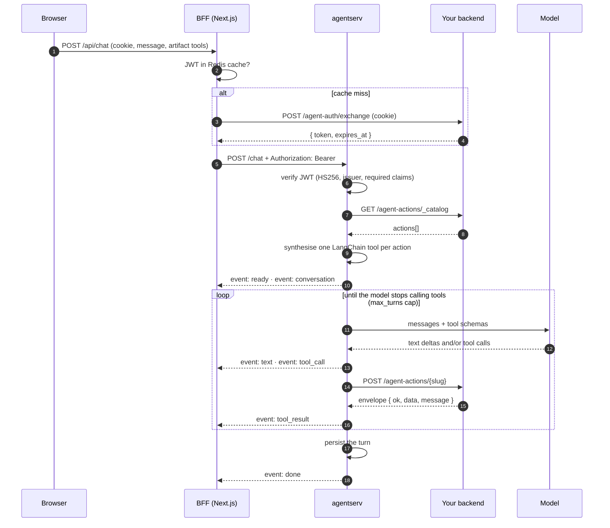
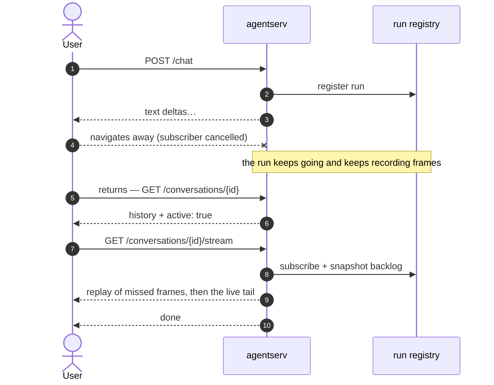
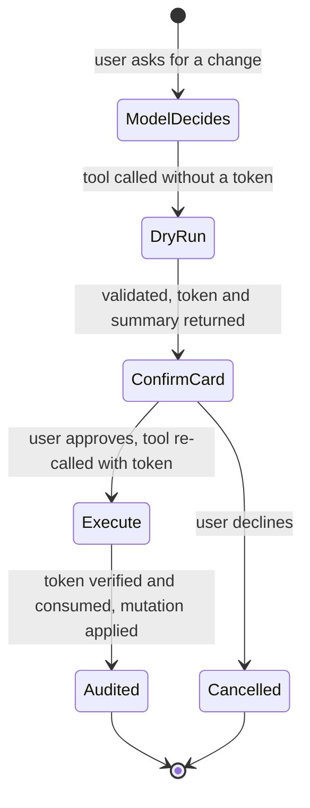

# Architecture

CogriaAgent is three tiers with one rule between them:

> The front-end only renders. The kernel only orchestrates. Your backend only
> executes. No tier reaches across another's job.

The practical payoff is that the LLM integration lives in exactly one place. Your
application never holds an API key, never assembles a prompt, and never needs a
change when you switch models.

## The tiers

```mermaid
flowchart LR
    subgraph T1["① Front-end + BFF"]
        direction TB
        A1["Chat, streaming, tool chips"]
        A2["Artifact panel"]
        A3["Session cookie → JWT"]
    end
    subgraph T2["② Orchestration kernel"]
        direction TB
        B1["LangGraph tool loop"]
        B2["Prompt + model"]
        B3["Tool synthesis from catalog"]
        B4["History + summarisation"]
    end
    subgraph T3["③ Your business backend"]
        direction TB
        C1["Catalog of actions"]
        C2["Action execution"]
        C3["Auth exchange"]
    end
    T1 <-->|"SSE + JWT"| T2
    T2 <-->|"HTTP contract"| T3
```



**① `packages/agent-ui`** — Next.js 16 + assistant-ui, public. Doubles as the
BFF: it is the only component that sees the user's session cookie, trades it for
a short-lived JWT (cached in Redis), and pipes the SSE stream through unchanged.

**② `packages/agentserv`** — Python, FastAPI, LangGraph. Binds to localhost and
is never exposed publicly; the BFF is its only caller. Holds the model API key.

**③ Your backend** — any language. Implements three HTTP endpoints and executes
the actions. If it is Python, `packages/backend-py` gives you the base class,
registry, proposal tokens, and audit for free.

## The injection seams

The kernel never imports a concrete backend, model client, prompt, or catalog.
It depends only on `Protocol`s defined in
[`protocols.py`](../packages/agentserv/cogria_agent/protocols.py), and
`build_app()` takes implementations as arguments. That indirection is the whole
reason swapping domains costs zero kernel changes.

| Seam | Answers | Bundled implementations |
|---|---|---|
| `CatalogProvider` | Where does the tool list come from? | `StaticCatalogProvider` (dict) · `HttpCatalogProvider` (your endpoint) |
| `ActionExecutor` | How does an action actually run? | in-process executor · `HttpActionExecutor` |
| `ConversationBackend` | Where is history persisted? | `InMemoryConversationBackend` · `SqlConversationBackend` (SQLite/Postgres) |
| `SystemPromptProvider` | What is the agent's persona? | `ConfigSystemPromptProvider` |
| LLM factory | Which model answers, which summarises? | `DefaultLLMFactory` |
| `AttachmentStore` | Where do uploaded bytes live? | `LocalDiskAttachmentStore` |
| `AttachmentRepository` | Where does file metadata live? | in-memory · SQL |
| `DocumentExtractor` | How does a PDF become text? | `DefaultDocumentExtractor` |

The LLM factory is duck-typed rather than a formal `Protocol` — any object with
`chat_llm()`, `summary_llm()` and `model_name()` works. The last three seams are
optional: pass them and uploads switch on, omit them and the server behaves
exactly as if the feature did not exist.

```python
app = build_app(
    config,
    conversation_backend=SqlConversationBackend(db_url),
    action_executor=RegistryExecutor(registry),
    catalog_provider=RegistryCatalogProvider(registry),
)
```

## A request end to end



Two details worth knowing:

**The graph runs independently of the response stream.** Generation happens in
its own task feeding a queue that the SSE generator drains. If the user navigates
away mid-reply, only the forwarding is cancelled — the turn still completes and
persists in full. The `done` event is emitted *after* the write, so a history
fetch triggered by it can never race the persistence.

**The user's message is persisted when the turn starts**, not when it ends, so a
history fetch made while the model is still typing already shows what the user
asked.

## Coming back to a reply in progress

Surviving the disconnect is only half of it — the user also has to see the reply
when they return. The kernel keeps a registry of runs in flight, keyed by
conversation, each holding every frame it has emitted plus the set of attached
subscribers. The `POST /chat` response is just one subscriber.



Subscribing and snapshotting the backlog happen together, with no `await`
between them. That is load-bearing rather than incidental: frames are fanned out
synchronously, so a suspension point in the middle would let one land in both
the snapshot and the queue and the user would see it twice.

If nothing is running the replay endpoint returns 404, which is the client's cue
that the turn finished while it was away — the tail is already in the database,
so it refetches instead of streaming.

Conversation ids are opaque UUIDs, and every conversation belongs to the JWT
subject that created it. Reads, continuations and replays all run the same
ownership gate, and a conversation that is missing, someone else's, or soft
deleted returns an identical 404 so an id cannot be probed for existence.

## Propose / confirm

Write actions are two-phase. The model can *propose* a mutation but cannot
*approve* it — approval is a separate round-trip that only a human closes.



The token is bound to the caller, the action, and a canonical fingerprint of the
parameters (recursively key-sorted JSON, SHA-256). It is consumed atomically on
first use and expires in minutes. Consequences worth stating plainly:

- the model cannot fabricate an approval,
- an approval cannot be replayed,
- parameters cannot be changed between what the user saw and what runs.

This also bounds the blast radius of prompt injection: even if a malicious
document convinces the model to attempt a destructive write, the user still sees
a confirm card describing it.

## Tool synthesis

Two kinds of tool reach the model, and they are dispatched very differently.

| | Action tool | Artifact tool |
|---|---|---|
| Declared in | your backend catalog | the front-end registry |
| Executes | on your backend | nowhere — it is a no-op |
| Purpose | do or read something | render in the side panel |
| The result is | an envelope | the `tool_call` event itself |

Artifact tools are how the model draws a chart without the framework knowing
anything about charts. Three ship builtin — `render_report` (line/bar/pie/table
with CSV export), `preview_image`, `compare_images` — and projects append their
own.

## Security model

- **The kernel is private.** It binds to localhost; the BFF is the only caller.
  There is no public route to the component holding the model key.
- **Identity never comes from the model.** Auth values live in the ambient
  request context, locked to the JWT, and are structurally separate from the
  parameter schema the model fills in. It cannot act as another user by writing
  different arguments.
- **Your backend authorises.** The per-request bearer is forwarded, so actions
  run with the end user's rights. `ability` on a catalog entry is your gate.
- **Turn caps.** `graph.max_turns` bounds tool round-trips per request, so a
  malformed loop cannot burn budget indefinitely.
- **Attachment text is data, never instructions** — enforced by explicit
  delimiters plus a system-prompt clause. See [Attachments](./attachments.md).

## Single-tenant by design

There is no tenant dimension anywhere: not in JWT claims, not in URL paths, not
in the schema. Multi-tenant deployments run one configured instance per tenant.
This keeps the contract small and removes an entire class of cross-tenant leak
from the threat model.
