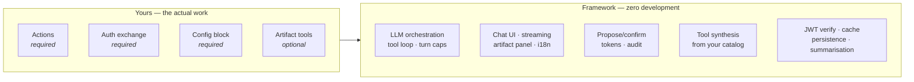
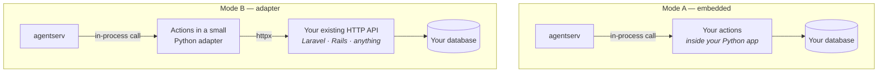

# Integration guide

Answers one question: **when I connect an existing application to CogriaAgent,
who builds what?**

## The short version

The framework side is fixed and requires no development from you. Your side
delivers three things — actions, an auth exchange, and a config block. Two
optional extras (rich rendering, quota data) can wait.



## What the framework always provides

| Capability | Component |
|---|---|
| LLM orchestration: LangGraph state machine, multi-round tool loop, `max_turns` cap | agentserv |
| Everything model-facing: API key, prompt assembly, streaming | agentserv |
| SSE protocol and streaming responses | agentserv |
| Dynamic tool synthesis: catalog → validated LangChain tools | agentserv |
| Propose/confirm orchestration and one-shot tokens | agentserv + backend-py |
| Chat interface, streamed rendering, tool-call visualisation | agent-ui |
| Artifact panel with builtin chart / image / comparison renderers | agent-ui |
| i18n scaffolding and error-state UI | agent-ui |
| JWT verification, Redis-cached exchange | agentserv + BFF |
| Action base class, registry discovery, audit, envelope translation | backend-py |
| Contract types, JSON Schema, conformance suite | contract |
| Conversation persistence (in-memory, SQLite, Postgres) and history summarisation | agentserv |

Persistence is worth calling out: the kernel owns it. Your backend implements no
storage endpoints. If you need history in your own database, implement the
`ConversationBackend` seam instead.

## What you must deliver

### 1. Actions — "what can this agent do?"

Each capability declares five things:

| Field | Meaning | Example |
|---|---|---|
| `name` | snake_case; the tool name the model sees | `create_invoice` |
| `description` | Natural-language: what it does **and when to use it** | *"Create an invoice for a customer. Use when the user wants to bill someone."* |
| `params_schema` | JSON Schema; drives tool synthesis and validation | `{ customer_id: integer, amount: number }` |
| handler | The code that runs | in-process call · HTTP call |
| `requires_confirm` | `true` for anything that mutates | `true` |

In Python this is an `AgentAction` subclass. In any other language, expose the
same information through the catalog endpoint.

**Write descriptions carefully.** They are the model's only basis for choosing a
tool. Most "the agent ignored my action" reports trace back to a description
that says what the function is rather than when to reach for it.

### 2. Auth exchange — "who is asking?"

Expose `POST /agent-auth/exchange`: verify the caller's existing session and
return a short-lived JWT carrying user and locale claims.

This is the one piece of auth code you must write yourself, because only your
application knows what "logged in" means. The framework provides the signing
helper; you provide the session check.

### 3. A config block

Locales, model, system prompt, graph limits. Usually environment variables —
see [Configuration](./configuration.md).

## Optional extras

**Artifact tools.** Want charts or embedded previews in the side panel? Register
artifact tools in the front-end registry and pick a renderer. Three builtins
cover most needs. Skip it entirely and text conversation works fine.

**Quota data.** Expose `/_quota/me` to feed usage banners. Note that the cost
governance layer is [not yet implemented](./roadmap.md); today `max_turns` is
the runaway-cost guard.

## Two integration modes

The deliverables above are identical in both. Only *where the handler runs*
differs.



| | Mode A — embedded | Mode B — adapter |
|---|---|---|
| Handler calls | Your internal services and models directly | Your existing HTTP API via `httpx` |
| Auth exchange lives | In your application | In the adapter, or still in your application |
| Actions written in | Your application's language | Always Python |
| Change to your app | Moderate: an actions layer | Minimal: none, if your API already covers it |
| Transactions and internal authz | Available — same process | Whatever your API exposes |

**Choosing.** Python application, or happy to run one? Mode A. Laravel, Rails,
or anything you would rather not add an LLM stack to? Mode B — the adapter is
all Python and your application only serves the API it already has.

This is not a decision to agonise over up front. Work through the deliverables
first; the mode falls out when you look at a specific application.

> There is also a pure-contract path: implement the three HTTP endpoints in any
> language and point `HttpCatalogProvider` / `HttpActionExecutor` at them. The
> conformance suite verifies you got it right.

## End-to-end sequence

```
1. [you]      List the capabilities the agent should have
2. [backend]  Write description + params_schema + handler for each
3. [backend]  Expose GET /agent-actions/_catalog       (automatic with backend-py)
4. [backend]  Expose POST /agent-auth/exchange
5. [you]      Run the conformance suite against your backend — all green
6. [you]      Write the config block
7. [you]      Deploy agentserv (pointed at your catalog + exchange) and agent-ui
8. [verify]   Say something in the chat; the model picks the right tool
9. [optional] Artifact rendering, SKILL-style docs, quota
```

## Acceptance checklist

- [ ] The catalog endpoint passes the conformance suite
- [ ] The exchange turns a live session into a valid JWT, and re-mints on expiry
- [ ] A read action: ask a question, the model calls it and explains the result
- [ ] A write action: propose → confirm card → approve → executes and audits
- [ ] Declining a confirm card leaves nothing mutated
- [ ] Invalid parameters and permission failures return clean errors the model
      relays in plain language
- [ ] Artifacts render in the side panel (if enabled)
- [ ] Uploaded documents are answerable (if enabled)
